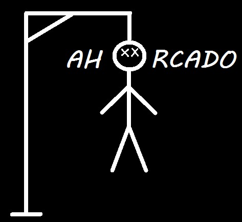

# Ahorcado - The Game

### El juego del ahorcado trata de que el jugador debe adivinar la palabra oculta ingresando, de una en una, las letras del teclado.
### El jugador tendra una acumulacion de puntos por cada letra que ingrese bien, es decir, cada letra que sea parte de la palabra sumara al jugador +10 puntos; caso contrario restara -5 puntos.
### Cabe aclarar que el jugador solo tendra por palabra 60seg para adivinarla.
### Si se te acaba el tiempo o la figura del ahorcado se ah dibujado por completo, PERDERA!
### Si el jugador adivina las 10 palabras ocultas, GANARA! y a la vez podra guardar sus puntos acumulados ingrsando su nombre de usuario! (max 5 caracteres)
### A JUGAR!!!
## VIDEO
* [Ahorcado_pygame.youtube](https://youtu.be/1b0UDCjqYDY)
## CREDITOS
#### Nombre: Barbizan Franco
#### Legajo: 112380
#### Materia: Prog/Lab Div 1C
#### Profesor: German Scarafilo
#### UTN AVELLANEDA
